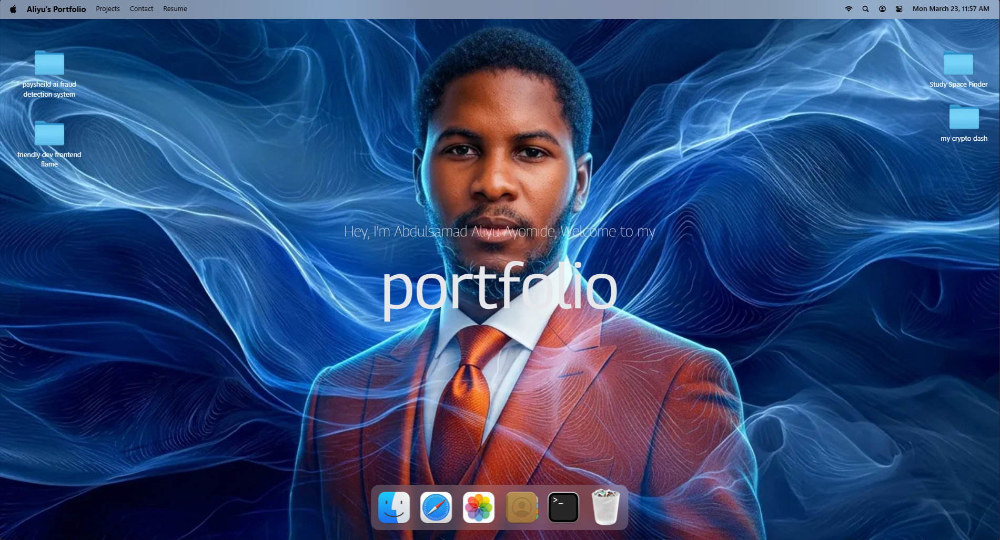
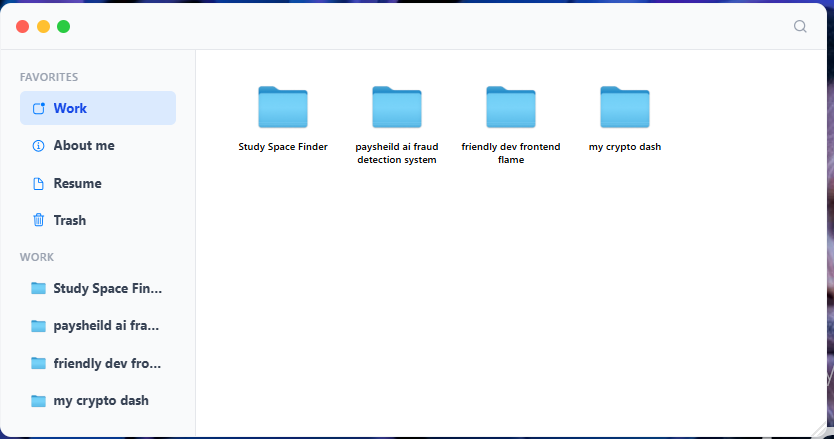
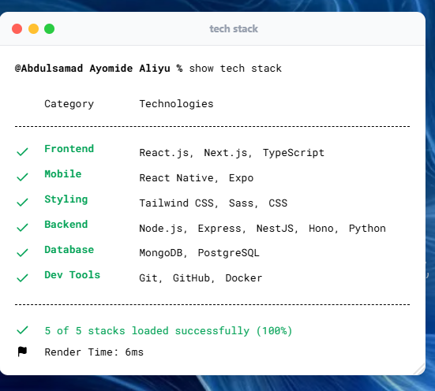
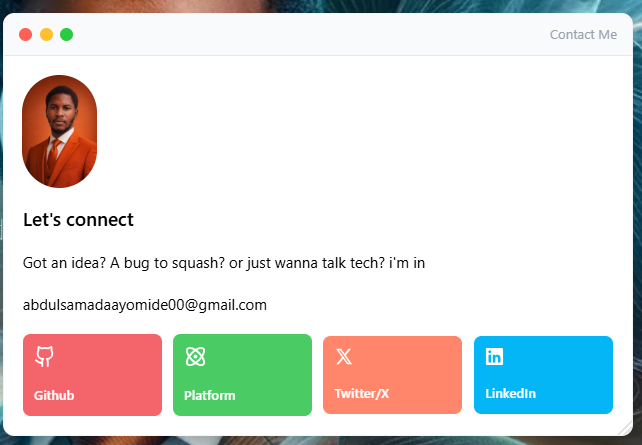
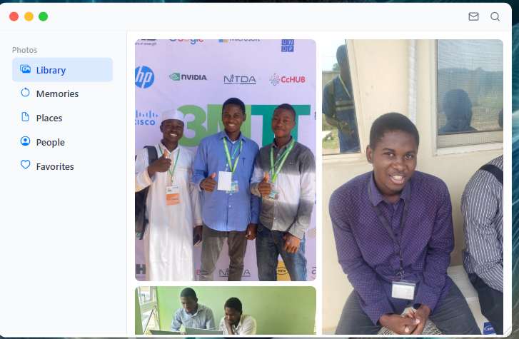
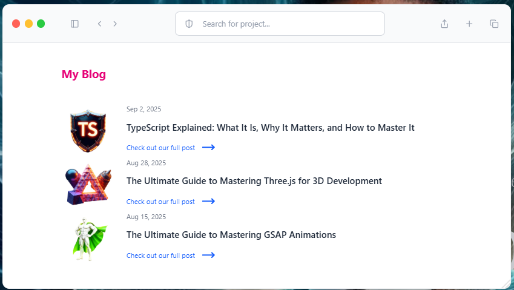

<div align="center">

<!-- BANNER IMAGE — replace with your own screenshot -->


<h1>🍎 macOS Portfolio</h1>

<p>
  A fully interactive, macOS-inspired developer portfolio built with <strong>React 19</strong>, <strong>Vite</strong>, <strong>GSAP</strong>, and <strong>Framer Motion</strong>.<br/>
  Browse projects, read articles, view the résumé, check the gallery, and get in touch — all inside a pixel-perfect macOS desktop experience.
</p>

[](https://github.com/alamulord)
[](https://github.com/alamulord/My-Portfolio/stargazers)
[](LICENSE)
[](https://react.dev)
[](https://vite.dev)

</div>

---

## 📸 Screenshots

| Desktop | Finder / Projects |
|:---:|:---:|
|  |  |

| Terminal / Skills | Contact |
|:---:|:---:|
|  |  |

| Gallery / Photos | Articles / Safari |
|:---:|:---:|
|  |  |

## ✨ Features

| Feature | Description |
|---|---|
| 🖥️ **macOS Desktop UI** | Authentic menu bar, dock, Spotlight-style navigation, and window chrome |
| 🗂️ **Finder (Portfolio)** | Browse project folders; open `.txt` descriptions, live URLs, and image previews |
| 📄 **Resume Viewer** | Scrollable, multi-page PDF viewer powered by `react-pdf` |
| 🖼️ **Gallery / Photos** | Masonry-style photo gallery with sidebar navigation (Library, Memories, Places…) |
| ✍️ **Articles / Safari** | Curated blog post reader with cards and external links |
| 💬 **Contact** | Quick contact card with links to GitHub, X/Twitter, LinkedIn, and dev.to |
| 💻 **Terminal (Skills)** | Tech-stack showcase styled as a macOS terminal window |
| 🗑️ **Trash / Archive** | Easter-egg archive section accessible from the Dock |
| 🎯 **GSAP Dock Animation** | Smooth icon magnification on mouse hover — just like the real macOS Dock |
| 🪄 **Framer Motion Windows** | All windows animate open / close with spring physics |
| 🗃️ **Draggable Desktop Icons** | Desktop project folders are draggable via GSAP `Draggable` |
| 💾 **Persistent State** | Active Finder tab and location survive window close/reopen (Zustand `persist`) |

---

## 🛠️ Tech Stack

### 🎨 Frontend


### 🎬 Animation


### 🗄️ State Management


### 📦 Utilities
| Package | Purpose |
|---|---|
| `react-pdf` + `pdfjs-dist` | Render PDF résumé inline |
| `lucide-react` | Icon library |
| `clsx` | Conditional class names |
| `dayjs` | Date formatting |
| `react-tooltip` | Dock tooltips |

---

## 🗂️ Project Structure

```
my-macos-portfolio/
├── public/
│   ├── images/          # Project screenshots, gallery photos, UI assets
│   └── icons/           # SVG icons (dock, navbar, socials)
└── src/
    ├── components/      # Shared UI: Background, Dock, Navbar, Welcome, WindowControls
    ├── windows/         # App windows: Finder, Resume, Gallery, Terminal, Safari, Contact…
    ├── constants/       # All app data (dock apps, blog posts, locations, gallery, socials)
    ├── store/           # Zustand stores (window state, location, favorites)
    ├── hoc/             # WindowWrapper higher-order component
    └── assets/          # Static assets (fonts, local PDFs)
```

---

## 🚀 Getting Started

### Prerequisites
- **Node.js** ≥ 18
- **npm** ≥ 9

### Installation

```bash
# 1. Clone the repository
git clone https://github.com/alamulord/My-Portfolio.git
cd My-Portfolio

# 2. Install dependencies
npm install

# 3. Start the dev server
npm run dev
```

Open [http://localhost:5173](http://localhost:5173) in your browser.

### Build for Production

```bash
npm run build
npm run preview
```

---

## 📁 Customising Content

All portfolio content lives in **`src/constants/index.js`**.

| Constant | What to edit |
|---|---|
| `WORK_LOCATION.children` | Add / remove project folders |
| `ABOUT_LOCATION.children` | Update personal photos and bio text |
| `RESUME_LOCATION.children` | Swap in your own PDF résumé |
| `blogPosts` | Change the articles shown in "Safari" |
| `gallery` | Add your gallery images |
| `socials` | Update your social links |
| `techStack` | Reflect your actual tech stack |

### Adding a New Project

```js
// Inside WORK_LOCATION.children array
{
  id: 9,                          // unique id
  name: 'My Cool Project',
  icon: '/images/folder.png',
  kind: 'folder',
  position: 'top-[40px] left-[520px]',   // desktop folder position
  windowPosition: 'top-[5vh] right-5',   // Finder window position
  children: [
    {
      id: 1,
      name: 'My Cool Project.txt',
      icon: '/images/txt.png',
      kind: 'file',
      fileType: 'txt',
      description: ['Line 1 about the project.', 'Line 2 about the project.'],
    },
    {
      id: 2,
      name: 'my-cool-project.vercel.app',
      icon: '/images/safari.png',
      kind: 'file',
      fileType: 'url',
      href: 'https://my-cool-project.vercel.app/',
    },
    {
      id: 4,
      name: 'screenshot.png',
      icon: '/images/image.png',
      kind: 'file',
      fileType: 'img',
      imageUrl: '/images/screenshot.png',   // add image to /public/images/
    },
  ],
},
```

---

## 🖼️ Image IDs Reference

The table below lists every image slot in the app so you know exactly which file to provide.

| ID / Path | Used In | Description |
|---|---|---|
| `/images/study-space-finder.png` | Finder → Project 1 | Screenshot of Study Space Finder |
| `/images/paysheild.jpeg` | Finder → Project 2 | Screenshot of Paysheild AI |
| `/images/friendly-dev.jpeg` | Finder → Project 3 | Screenshot of Friendly Dev Portfolio |
| `/images/crypto-dash.jpeg` | Finder → Project 4 | Screenshot of My Crypto Dash |
| `/images/abdulsamad.png` | About Me | Profile photo |
| `/images/gal2.jpg` | About Me / Gallery | Casual photo |
| `/images/gal8.jpeg` | About Me / Gallery | Conference photo |
| `/images/gal3.jpg` | Gallery | Gallery image 6 |
| `/images/gal4.jpg` | Gallery | Gallery image 5 |
| `/images/gal5.jpg` | Gallery | Gallery image 3 |
| `/images/gal6.png` | Gallery | Gallery image 4 |
| `/images/gal7.jpg` | Gallery | Gallery image 7 |
| `/images/blog1.png` | Articles | TypeScript article thumbnail |
| `/images/blog2.png` | Articles | Three.js article thumbnail |
| `/images/blog3.png` | Articles | GSAP article thumbnail |
| `/images/trash-1.png` | Trash/Archive | Archive image 1 |
| `/images/trash-2.png` | Trash/Archive | Archive image 2 |
| `/images/folder.png` | Finder / Desktop | Folder icon |
| `/images/txt.png` | Finder | Text file icon |
| `/images/pdf.png` | Finder | PDF file icon |
| `/images/image.png` | Finder | Image file icon |
| `/images/safari.png` | Finder | URL / Safari link icon |
| `/images/finder.png` | Dock | Finder dock icon |
| `/images/photos.png` | Dock | Photos dock icon |
| `/images/contact.png` | Dock | Contact dock icon |
| `/images/terminal.png` | Dock | Terminal dock icon |
| `/images/trash.png` | Dock | Trash dock icon |

---

## 🔗 Connect

<p>
  <a href="https://github.com/alamulord"></a>
  <a href="https://www.linkedin.com/in/aliyu-a-ayomide/"></a>
  <a href="https://x.com/alamulord"></a>
  <a href="https://dev.to/alamulord"></a>
</p>

---

## 📝 License

This project is open source and available under the [MIT License](LICENSE).

---

<div align="center">
  Made with ❤️ by <strong>Abdulsamad Ayomide Aliyu</strong>
</div>
